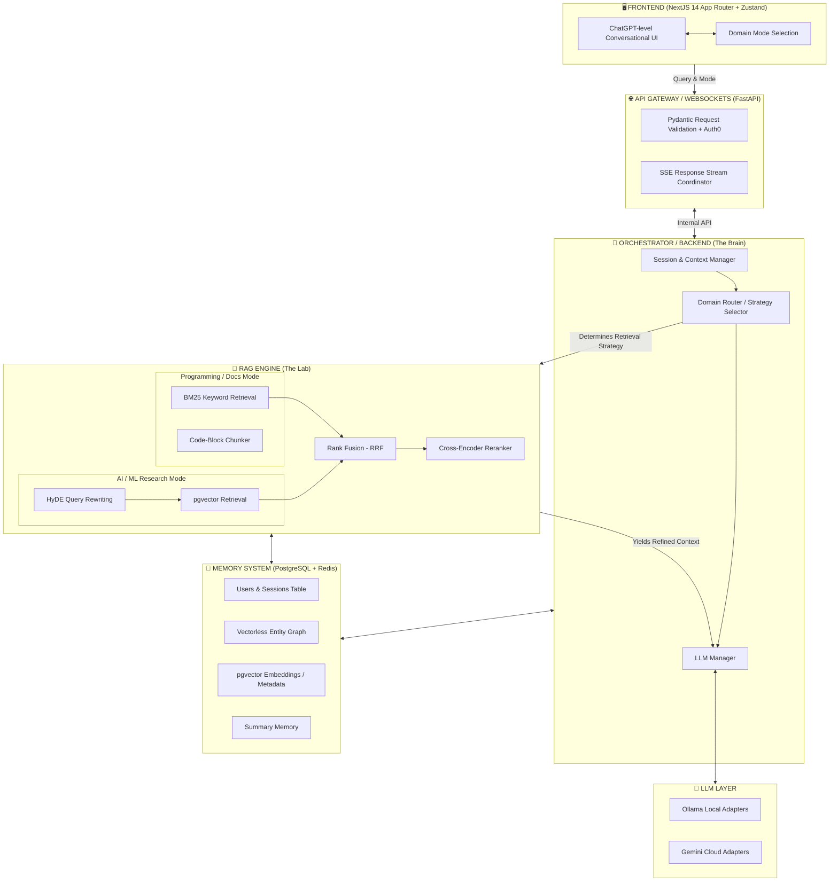

<div align="center">


# **RAG Research Assistant**
*Enterprise-Grade LLM Engineering & Autonomous Intelligence Lab*

[](https://fastapi.tiangolo.com/)
[](https://nextjs.org/)
[](https://neon.tech/)
[](https://upstash.com/)
[](https://docker.com/)


</div>

---

## 🎯 **What We Built (And Why)**

Most AI tutorials end at a simple OpenAI API wrapper. We built a **Production-Grade RAG Orchestration Engine** designed to scale. 

**The goal:** Create an AI system that doesn't just pass text to a model, but actually *reasons* about how to retrieve information. By decoupling the Frontend, the API Gateway, the RAG Retrieval Engine, and the Memory layers, we created a system capable of acting like a true AI researcher. If you ask a coding question, it switches to exact-match keyword search (BM25). If you ask an architectural question, it switches to semantic vector search (`pgvector`) combined with Hypothetical Document Embeddings (HyDE).

---

## 📐 **System Architecture Design**



---

## 🌐 **Frontend Architecture & Engineering**

The frontend is not merely a chat interface. It is an **adaptive intelligence control panel** built on an edge-native stack designed to parse continuous bytecode streams in real-time.

### 1. `Next.js 14` (App Router)
We utilized Next.js Server Components for initial payload delivery, but strictly offloaded the intensive streaming logic to Client Components. The App router allows us to keep routing clean while bridging environment variables (like API URLs) securely to the client.

### 2. `Zustand` over Redux
Standard state managers like Redux trigger massive re-render cycles that destroy UI performance during high-speed LLM streaming. **Zustand** gives us atomic, isolated store slices. When a message chunk arrives, Zustand cleanly updates the `partialMessage` buffer without causing unrelated components (like the sidebar or settings modal) to re-render.

### 3. Server-Sent Events (SSE) & The `fetch` API
Real-time typing isn't magic; it's streaming byte chunks. We consume the FastAPI backend stream using the native browser `ReadableStream`.
*   **How it works**: The user sends a POST request. The server doesn't close the connection; it holds it open via `text/event-stream`.
*   We use a while-loop (`await reader.read()`) to catch byte chunks as they are emitted from the backend.
*   A custom string decoder parses the JSON payloads instantly and pushes them into the Zustand state.

### 4. `react-markdown` & `rehype-highlight`
LLMs output raw markdown. We pipe the dynamically updating text string through `react-markdown`, which renders formatting on the fly. We paired it with `rehype-highlight` so that when the RAG engine generates Python or JavaScript code blocks, they are automatically wrapped in syntax highlighting.

### 5. `framer-motion` & `tailwind-css`
The visual identity relies on **Tailwind CSS** for rapid glassmorphism and gradient layout utilities. We integrated **Framer Motion** for physics-based layout transitions. When a new message appears, it doesn't snap abruptly into existence; it smoothly animates into the DOM tree.

### 6. The Domain "Mode" System (Core Innovation)
Instead of hiding the RAG complexity, we expose it. When a user clicks "AI Research" or "Programming", the frontend injects a specific intent payload into the API request. 
**This enables the frontend to act as the steering wheel for the backend:**
1.  **AI/ML Mode**: Triggers the backend to use HyDE and Vector Search for deep academic synthesis.
2.  **Programming Mode**: Tells the backend to switch entirely to BM25 exact-keyword matching to find variable names and syntax rules.

---

## 🧠 **Backend Orchestration & Control Plane**

The backend is not just an API wrapper; it is an **Asynchronous LLM Orchestration Engine**. It acts as the central nervous system, managing concurrency, evaluating user intent, and dynamically piping context through retrieval pipelines.

### 1. `FastAPI` + `Uvicorn` (The Async Foundation)
Why not Django or Flask? Standard synchronous architectures block the main execution thread while waiting for the LLM to process data. 
*   **FastAPI** is built on top of Starlette and the ASGI async standard.
*   When a user query hits our server, the `Uvicorn` worker handles the connection asynchronously (`async def`). 
*   This means the CPU can pause execution on the LLM network request, go serve 100 other users, and jump back the millisecond the LLM responds. This is how we achieve internet-scale concurrency.

### 2. `Pydantic v2` (The Core Validation Layer)
AI payloads are notoriously messy. We utilize **Pydantic** to enforce strict type-safety across the system boundaries. 
*   Before a query reaches the Orchestrator, Pydantic intercepts the JSON payload, verifies that the `session_id` is a valid UUID, guarantees that the `user_id` matches the correct database format, and throws a safe `422 Unprocessable Entity` error if any data is corrupted.

### 3. Server-Sent Events (SSE) via `StreamingResponse`
Our most complex engineering feat is the real-time interaction layer.
*   We use Python **Generators** (`yield`) to stream data. 
*   As the RAG engine processes the initial context, we `yield` the retrieved documents to the frontend instantly.
*   Then, as the OpenAI/Ollama layer generates text token-by-token, we `yield` those exact string segments directly out of the HTTP connection, creating the famous "typing" effect without ever closing the socket.

---

## 🧮 **RAG Engine (Retrieval-Augmented Generation)**

The RAG Engine is the true intelligence layer of the system. Native LLMs hallucinate; the RAG module mathematically guarantees factual accuracy by pulling context from structured knowledge vectors prior to generation.

### 1. `sentence-transformers` & `FastEmbed`
We parse PDFs and text documents and chunk them algorithmically (usually 300 to 500 tokens). We then use local embedding models to convert those English text chunks into high-dimensional numerical vectors (lists of 1536 float numbers). 

### 2. BM25 (Best Matching 25) Keyword Algorithms
Vectors are great for *semantic meaning* (e.g., matching "puppy" to "dog"), but terrible for exact keyword overlap (matching a specific API variable like `getUserProfile()`). We implemented a pure **BM25 TF-IDF** algorithm, heavily backed by PostgreSQL's native full-text search (`tsvector`), to calculate term frequency.

### 3. Reciprocal Rank Fusion (RRF)
When the user asks a question, we actually do two separate searches simultaneously: an Index Vector Search and a BM25 Keyword Search. 
*   **The Problem:** Vector DBs return a cosine similarity score (0.0 to 1.0), and BM25 returns an arbitrarily massive integer score (like 42.5). You cannot compare them.
*   **The Solution:** We run an **RRF algorithm**, which ignores the raw scores and entirely relies on the *Rank Position* of the chunk to fuse both lists mathematically into a single, high-fidelity ranking list.

### 4. Cross-Encoder Reranking
We take the top 20 chunks from the RRF output and run them through a much heavier Cross-Encoder LLM. The Cross-Encoder reads the original question and the chunk *simultaneously* and assigns a much more accurate relevance score, cutting the top 20 chunks down to the top 3 most pristine pieces of context.

### 5. Hypothetical Document Embeddings (HyDE)
If a user asks: *"What is zero-shot learning?"*
The engine first asks the LLM to blindly guess the answer: *"Zero-shot learning is a machine learning paradigm where..."*
We then take that *fake, generated answer*, embed it into a vector, and search the Vector Database using the fake answer instead of the question. This astronomically increases similarity matching precision.

---

## 💾 **Memory & Database Persistence Layer**

To build continuous intelligence, an AI must remember what it has learned. We constructed a highly specialized persistence layer that spans across relational schema logic, fast-access caching, and high-dimensional vector memory.

### 1. Neon PostgreSQL & Serverless Database Architecture
Running a traditional PostgreSQL instance on AWS RDS costs $15 to $50 a month, even when completely idle. We entirely circumvented this by migrating to **Neon Serverless Postgres**.
*   **Scale-to-Zero Architecture**: The Neon cluster goes completely to sleep when no users are executing queries, reducing database costs to effectively zero dollars during low-traffic phases.
*   **Connection Pooling**: Since FastAPI spins up async workers rapidly, standard connection limits would crash the database. We utilize Neon's native transaction pooling to handle thousands of concurrent transactions gracefully.

### 2. The `pgvector` Extension (Vector Memory)
Instead of paying for expensive third-party Vector Databases like Pinecone or Weaviate, we enabled the `pgvector` extension natively inside our Postgres instance.
*   **The Power**: This allowed us to add an `embedding VECTOR(1536)` column straight into our standard relational tables!
*   **The Math**: We execute `L2 Distance (<->)` and `Cosine Similarity (<=>)` operators natively inside our SQL queries, filtering semantic embeddings while simultaneously joining relational metadata (like `user_id` or `timestamp`) in a single query hop.

### 3. Upstash Redis (The Vercel Edge Cache)
Traditional Redis requires persistent TCP connections, which fail miserably in Serverless architectures like Cloud Run or Vercel Edge.
*   We deployed **Upstash Redis**, which provides an HTTP REST API wrapper over a Redis instance.
*   Our `MemoryClient` issues heavily concurrent `asyncio.gather` requests to the Upstash HTTP endpoints to instantly fetch the last 10 chat messages of the active session. This heavily reduces the load on our Postgres database.

---

## 🚀 **Deployment & Optimization Strategy**

We strictly follow: **"Build like production — run like a startup."**

*   **Google Cloud Run**: We containerized the backend via Docker (`python:3.11-slim`) and push it to Google Cloud Run. By setting `--min-instances 0`, the FastAPI server entirely shuts down when no one is using it, costing $0.
*   **Neon Postgres & Upstash**: Both are serverless cloud databases. They scale to zero automatically when inactive.
*   **Avoiding Traps**: We specifically avoided deploying Cloud SQL or Vertex AI managed instances early on, saving hundreds of dollars a month in "always-on" VM overhead.

### Command Line Deployment:

1. **Build the Production Container**:
```bash
docker build -t rag-backend -f infra/docker/backend/Dockerfile .
```

2. **Push to Google Artifact Registry**:
```bash
docker tag rag-backend asia-south1-docker.pkg.dev/PROJECT_ID/rag-backend-repo/rag-backend:latest
docker push asia-south1-docker.pkg.dev/PROJECT_ID/rag-backend-repo/rag-backend:latest
```

3. **Deploy to Google Cloud Run**:
```bash
gcloud run deploy rag-backend \
  --image asia-south1-docker.pkg.dev/PROJECT_ID/rag-backend-repo/rag-backend:latest \
  --region asia-south1 \
  --platform managed \
  --allow-unauthenticated \
  --memory 512Mi \
  --cpu 1 \
  --max-instances 2 \
  --min-instances 0 \
  --port 8080
```

<div align="center">
  <br>
  <sub>Built with precision globally by the <b>LLM Engineering Lab Engine</b>.</sub><br>
  <sub><i>"Advanced architecture requires advanced discipline."</i></sub>
</div>
