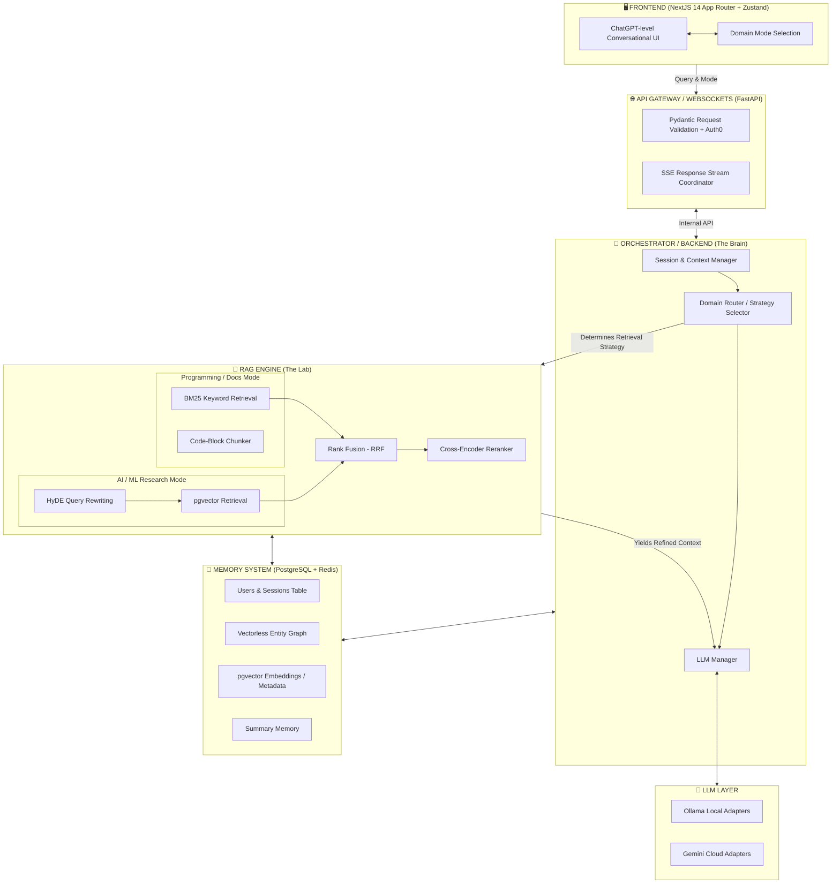

<div align="center">


# **RAG Research Assistant**
*Enterprise-Grade LLM Engineering & Autonomous Intelligence Lab*

[](https://fastapi.tiangolo.com/)
[](https://nextjs.org/)
[](https://neon.tech/)
[](https://upstash.com/)
[](https://docker.com/)


</div>

---

## 🎯 **What We Built (And Why)**

Most AI tutorials end at a simple OpenAI API wrapper. We built a **Production-Grade RAG Orchestration Engine** designed to scale. 

**The goal:** Create an AI system that doesn't just pass text to a model, but actually *reasons* about how to retrieve information. By decoupling the Frontend, the API Gateway, the RAG Retrieval Engine, and the Memory layers, we created a modular system capable of acting like a true AI researcher.

---

## 📐 **System Architecture Design**



---

## 🌐 **Frontend Architecture & Engineering**

The frontend is an **adaptive intelligence control panel** built on an edge-native stack designed to parse continuous bytecode streams in real-time.

### 🏗️ 1. Component Layer (UI)
All UI is built using **modular, reusable components**, grouped by responsibility:
* `chat/` → messaging system and token streaming rendering.
* `sidebar/` → navigation and history.
* `settings/` → system control panel.
* `modals/` → floating UI layers.
* `debug/` → **RAG transparency overlay**. Displays the raw document chunks retrieved, mathematical similarity scores, and Vector DB latency, proving system intelligence visually.
* `profile/` → user interaction layer.

### ⚡ 2. The Streaming Engine & State Layer (`Zustand` & `fetch`)
* **`Zustand` over Redux**: Standard state managers trigger massive re-render cycles that destroy UI performance during high-speed LLM streaming. **Zustand** gives us atomic, isolated store slices. When a message chunk arrives, Zustand cleanly updates the `partialMessage` buffer without re-rendering the sidebar or modals.
* **Server-Sent Events (SSE)**: We consume the FastAPI backend stream using the native browser `ReadableStream`. We use a while-loop (`await reader.read()`) to catch byte chunks as they are emitted from the backend, parsing JSON payloads instantly.
* **Error Boundary & Crash Protection**: We engineered a graceful error boundary inside our `stream.ts` utility. If FastAPI throws a `422 Unprocessable Entity` due to malformed payloads, the React application terminates the stream locally and gracefully types out the explicit backend error into the Chat Bubble instead of crashing the app.

### 🎨 3. UI/UX Libraries & NextJS
* **`Next.js 14` (App Router)**: We utilized Next.js Server Components for initial payload delivery, but strictly offloaded the intensive streaming logic to Client Components. 
* **`react-markdown` & `rehype-highlight`**: When the RAG engine generates Python or JavaScript code blocks, they are automatically wrapped in native syntax highlighting.
* **`framer-motion` & `tailwind-css`**: Provides layout transitions. When a new message appears, it doesn't snap abruptly; it smoothly animates into the DOM tree.

---

## 🧠 **Backend Orchestration & Control Plane**

The backend is an **Asynchronous LLM Orchestration Engine**. It acts as the central nervous system, managing concurrency and evaluating user intent.

### ⚙️ 1. Core Responsibilities & Flow
* **Intent & Domain Routing**: The frontend payload contains a "Domain Mode". The orchestrator inspects this mode and assigns a specific Retrieval Strategy. (e.g. `mode == "programming"` swaps out the conceptual Vector database retrieval client for the BM25 lexical keyword client to prioritize exact code matching).
* **Context Aggregation**: The orchestrator fires off multiple internal tasks simultaneously (`asyncio.gather`) to fetch Short-Term Memory from Upstash Redis, and RAG Context from the memory layer.
* **Streaming Response Engine**: We use Python Generators (`yield`) to stream data. As OpenAI/Ollama generates text token-by-token, we `yield` those exact string segments directly out of the HTTP connection (`StreamingResponse`), creating real-time typing without heavy WebSockets.

### 📦 2. Technical Stack Deep Dive
* **`FastAPI` + `Uvicorn`**: Handles async web scale. The ASGI worker model allows the CPU to pause execution on an LLM network request, serve 100 other users, and jump back the millisecond the LLM responds without thread-blocking.
* **`Pydantic v2` (Validation Layer)**: AI payloads are messy. Pydantic intercepts JSON payloads, verifies that `session_id` and `user_id` are valid UUIDs, and guarantees type-safety across system boundaries.
* **`google-generativeai` & `ollama`**: Abstracted adapter clients to easily swap between local privacy-first models and powerful cloud frontier models.

---

## 🧮 **RAG Engine (Retrieval-Augmented Generation)**

The RAG Engine provides high-quality context to the LLM. It is mathematically factual and fully decoupled from the API routes (`retrieval_client → rag_engine.retrieve()`).

### 📦 1. Core Components

#### 🔹 Document Ingestion Pipeline
Handles transformation of raw data into structured knowledge:
* **Transformers**: PDF and text loaders.
* **Cleaning Layer**: Removes references, citations, and noise.
* **Recursive Chunking**: Domain-aware slicing (300 to 500 tokens).
* **Embedding Generation**: Uses native local models or `sentence-transformers` (`FastEmbed`) to convert text chunks into high-dimensional numerical vectors (lists of 1536 float numbers).
* **Storage**: Injects directly into PostgreSQL with `pgvector` indexing.

#### 🔹 Query Intelligence Layer
Improves retrieval quality before searching:
* **Query Rewriting** → makes sloppy user queries more specific.
* **Multi-Query Generation** → explodes a single query into multiple hidden questions to explore multiple perspectives simultaneously.
* **HyDE (Hypothetical Document Embeddings)** → asks the LLM to blindly generate a "fake" synthetic answer first. We then embed that synthetic answer into a vector and search the Vector Database using it, which astronomically increases semantic match precision based on expected answer structure.

#### 🔹 Retrieval Strategies
* **Vector Retrieval**: Captures semantic conceptual meaning using `pgvector`.
* **Keyword Retrieval (BM25)**: Vectors are terrible at finding exact variable names or stack traces. We implemented a pure **BM25 TF-IDF** algorithm, backed by PostgreSQL's native `tsvector` full-text search, to capture exact matches.
* **Hybrid Fusion (RRF)**: Vector DBs output cosine similarity (0.0 to 1.0), BM25 outputs massive ints (e.g., 42). You cannot compare them directly. We run a **Reciprocal Rank Fusion (RRF)** algorithm that relies purely on the *Rank Position* of chunks to fuse both lists mathematically into a single, high-fidelity ranking list.

#### 🔹 Reranking Layer
* Takes the top 20 chunks from the RRF output and runs them through a much heavier **Cross-Encoder LLM**. The Cross-Encoder reads the original question and the chunk *simultaneously* and assigns an ultra-accurate relevance score, cutting the Top-20 hits down to the Top-3 most pristine pieces of context.

#### 🔹 Evaluation System
Ensures retrieval quality is fundamentally measurable:
* **Recall@K** metric scoring
* Keyword-based ground truth matching
* Dedicated Python evaluation scripts for benchmarking pipeline iteration.

### 📤 2. Standardized Output Format
```json
{
  "chunks": [
    {
      "content": "Zero-shot learning is a machine learning paradigm...",
      "score": 0.92,
      "metadata": {
        "chunk_id": "8f3a3-bbc...",
        "document_id": "99dd1-...",
        "domain": "ai_ml"
      }
    }
  ],
  "meta": {
    "strategy": "hybrid",
    "top_k": 20,
    "top_n": 5
  }
}
```

---

## 💾 **Memory & Database Persistence Layer**

To build continuous intelligence, an AI must remember what it has learned. We constructed an elite persistence layer that spans across relational schema logic, fast-access caching, and high-dimensional memory.

### 🧠 1. Multi-Level Memory Architecture
* **Short-Term Memory (Volatile)**: Stored in Upstash Redis. When a user asks "What did you just say?", pulling from a heavy Postgres DB is too slow. The Redis cache holds a rapid FIFO queue of the fast-paced recent conversation.
* **Long-Term Semantic Memory (Episodic)**: If a chat runs for hours, dumping it fully into the prompt window destroys the LLM context limit and skyrockets costs. Instead, we regularly summarize old chats, generate an embedding vector from the summary, and store it. When the user asks something they mentioned 3 weeks ago, the semantic search injects only that specific memory fragment into the prompt window.
* **User Personalization Layer**: Tracks behaviors and signals over time via relational joins.

### 📦 2. Technical Stack Deep Dive
* **Neon PostgreSQL (Serverless)**: Running a traditional Postgres RDS costs continuous baseline money. We migrated to Neon Serverless Postgres. The DB cluster scales to zero when idle, effectively costing $0 during development. 
* **Connection Pooling**: Neon's native transaction pooling handles the massive concurrent async execution waves sent by FastAPI.
* **The `pgvector` Extension**: Enabled natively inside Postgres, allowing us to add `embedding VECTOR(1536)` columns straight into standard relational tables to compute lightning fast `L2 Distance (<->)` queries.
* **Upstash Redis**: Traditional Redis requires persistent TCP connections (which fail in Serverless Cloud Run environments). We deployed **Upstash**, which wraps Redis in a lightning-fast HTTP REST API.

---

## 🚀 **Deployment & Operation**

We strictly follow: **"Build like production — run like a startup."**

*   **Google Cloud Run**: We containerized the backend via Docker (`python:3.11-slim`) and push it to Google Cloud Run. By setting `--min-instances 0`, the FastAPI server entirely shuts down when no one is using it, costing $0.
*   **Decoupled Services**: The system strictly avoids deploying Cloud SQL or Vertex AI managed instances early on to save hundreds of dollars a month in "always-on" overhead.

### Command Line Deployment Workflow:

1. **Build the Production Container**:
```bash
docker build -t rag-backend -f infra/docker/backend/Dockerfile .
```

2. **Push to Google Artifact Registry**:
```bash
docker tag rag-backend asia-south1-docker.pkg.dev/PROJECT_ID/rag-backend-repo/rag-backend:latest
docker push asia-south1-docker.pkg.dev/PROJECT_ID/rag-backend-repo/rag-backend:latest
```

3. **Deploy to Google Cloud Run**:
```bash
gcloud run deploy rag-backend \
  --image asia-south1-docker.pkg.dev/PROJECT_ID/rag-backend-repo/rag-backend:latest \
  --region asia-south1 \
  --platform managed \
  --allow-unauthenticated \
  --memory 512Mi \
  --cpu 1 \
  --max-instances 2 \
  --min-instances 0 \
  --port 8080
```

<div align="center">
  <br>
  <sub>Built with precision globally by the <b>LLM Engineering Lab Engine</b>.</sub><br>
  <sub><i>"Advanced architecture requires advanced discipline."</i></sub>
</div>
