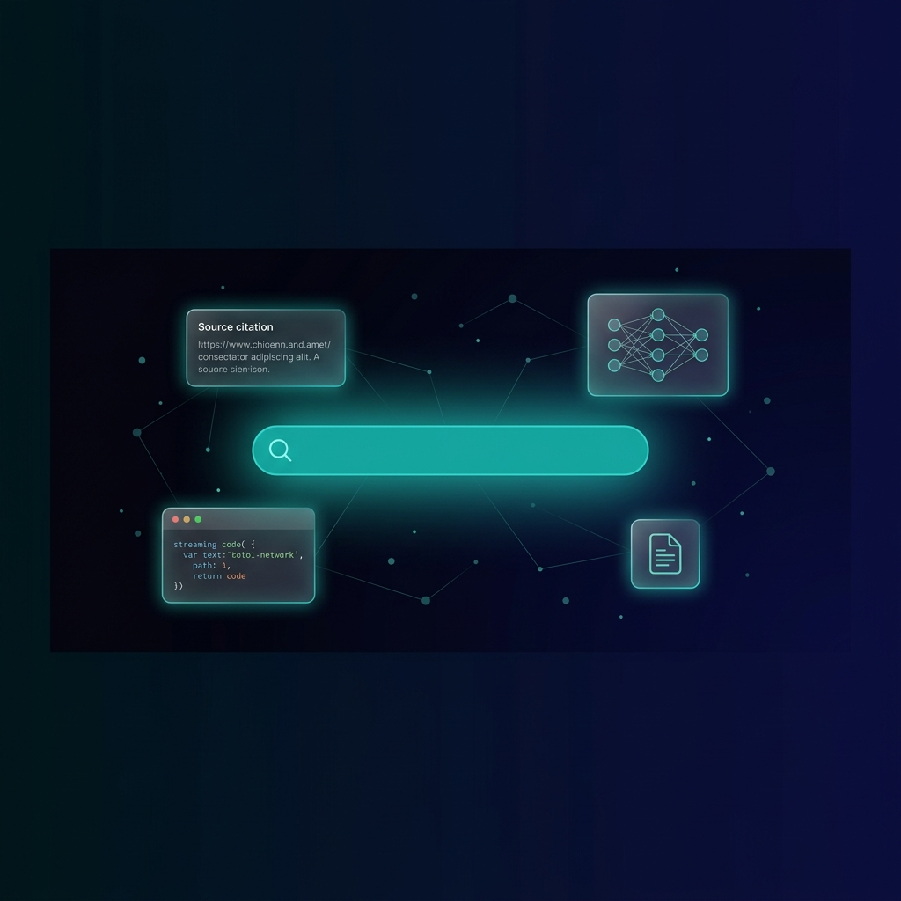

<div align="center">

<!-- ═══════════════════ CAPSULE HEADER ═══════════════════ -->


<br />

<!-- ═══════════════════ HERO BANNER ═══════════════════ -->


<br /><br />

<!-- ═══════════════════ ANIMATED TYPING ═══════════════════ -->
<a href="#-quick-start">

</a>

<br />

<!-- ═══════════════════ TECH BADGES ═══════════════════ -->
<p>


</p>

<!-- ═══════════════════ STATUS BADGES ═══════════════════ -->
<p>


</p>

<br />

**A full-stack, open-source AI Research Assistant that runs entirely on your machine.**
<br />
<sub>No API keys required · No cloud dependency · Just Ollama + your documents</sub>

<br /><br />

[**🚀 Quick Start**](#-quick-start) &nbsp;·&nbsp; [**✨ Features**](#-features) &nbsp;·&nbsp; [**🏗 Architecture**](#-system-architecture) &nbsp;·&nbsp; [**📖 Usage**](#-usage-guide) &nbsp;·&nbsp; [**🛠 Dev Guide**](#-development)

</div>

<br />

<!-- ═══════════════════════════════════════════════════════════════ -->
<!-- ═══════════════════ DIVIDER ═══════════════════════════════════ -->
<!-- ═══════════════════════════════════════════════════════════════ -->


## ✨ Features

<table>
<tr>
<td width="50%" valign="top">

###  Intelligent Search
> Hybrid retrieval that outperforms naive vector search

- **BM25 + pgvector** — Full-text & semantic search combined via Reciprocal Rank Fusion
- **HyDE Expansion** — Hypothetical Document Embeddings for 40%+ better academic recall
- **Cross-Encoder Reranking** — MS-MARCO reranks top results for surgical precision
- **Web Search** — Brave + Tavily with parallel content extraction via trafilatura

</td>
<td width="50%" valign="top">

###  Smart Model Routing
> The right model for every task — automatically

- **5 Focus Modes** — General · Academic · Code · Writing · Research
- **Auto-Router** — Selects the optimal Ollama model per focus mode
- **Multi-Model** — Llama 3.2, Phi-4 Mini, Qwen 2.5 out of the box
- **SSE Streaming** — Real-time token-by-token with live citations

</td>
</tr>
<tr>
<td width="50%" valign="top">

###  Premium Dark UI
> Premium dark interface with micro-animations

- **Next.js 16** with Turbopack for instant HMR
- **Tailwind CSS v4** dark theme with glassmorphism
- **Framer Motion** animated sources, answers & transitions
- **Zustand** state management with localStorage persistence

</td>
<td width="50%" valign="top">

###  Production Backend
> Async-first, built for throughput

- **FastAPI** with SSE streaming responses
- **pgvector** 384-dim embedding storage in PostgreSQL
- **Redis 7** sliding-window conversation memory
- **Docker Compose** single-command deployment
- **PDF & Text Ingestion** with domain-aware chunking

</td>
</tr>
</table>

<br />


## 🏗 System Architecture

<div align="center">

```
                              ┌─────────────────────────────────────────────────┐
                              │            PERPLEXITY CLONE v2.0                │
                              └─────────────────────────────────────────────────┘

 ┌──────────────────────┐         SSE Stream          ┌──────────────────────────┐
 │                      │  ◄──────────────────────▶   │                          │
 │   🖥  FRONTEND       │    sources → tokens →       │   ⚡ BACKEND             │
 │   Next.js 16         │    related → done           │   FastAPI + Uvicorn      │
 │                      │                             │                          │
 │   ┌──────────────┐   │                             │   ┌────────────────────┐ │
 │   │ SearchBar    │   │      POST /search/stream    │   │  Search Router     │ │
 │   │ SourcesPanel │──────────────────────────────▶  │   │  ┌──────────────┐  │ │
 │   │ AnswerBlock  │   │                             │   │  │ Brave / Tav  │  │ │
 │   │ Sidebar      │   │                             │   │  │ Web Fetcher  │  │ │
 │   └──────────────┘   │                             │   │  └──────────────┘  │ │
 │                      │                             │   └────────────────────┘ │
 │   Zustand Store      │                             │            │             │
 │   Framer Motion      │                             │   ┌────────▼───────────┐ │
 │   Tailwind v4        │                             │   │  RAG Engine        │ │
 │                      │                             │   │  ┌──────────────┐  │ │
 └──────────────────────┘                             │   │  │ BM25 + Vec   │  │ │
        :3000                                         │   │  │ HyDE         │  │ │
                                                      │   │  │ Reranker     │  │ │
 ┌──────────────────────┐                             │   │  └──────────────┘  │ │
 │  🗄  PostgreSQL       │ ◄──────────────────────▶   │   └────────────────────┘ │
 │  + pgvector + pg_trgm │                            │            │             │
 └──────────────────────┘                             │   ┌────────▼───────────┐ │
        :5432                                         │   │  🦙 Ollama Client  │ │
                                                      │   │  Streaming Chat    │ │
 ┌──────────────────────┐                             │   └────────────────────┘ │
 │  ⚡ Redis 7           │ ◄──────────────────────▶   │            │             │
 │  Session Memory       │                            │   ┌────────▼───────────┐ │
 └──────────────────────┘                             │   │  💾 Persistence    │ │
        :6379                                         │   │  DB + Redis Memory │ │
                                                      │   └────────────────────┘ │
 ┌──────────────────────┐                             │                          │
 │  🦙 Ollama            │ ◄──────────────────────▶   └──────────────────────────┘
 │  Local LLM Inference  │                                      :8000
 └──────────────────────┘
        :11434
```

</div>

<br />

### 📡 SSE Streaming Protocol

<div align="center">

```
Client ──POST──▶ /search/stream ──────────────────────────────────────▶ Ollama
                       │
                       │   ┌─────────────────────────────────────────┐
                       ├──▶│  event: sources                         │
                       │   │  data: [{"title","url","type":"web"}]   │
                       │   └─────────────────────────────────────────┘
                       │   ┌─────────────────────────────────────────┐
                       ├──▶│  event: token                           │  ← repeated
                       │   │  data: "individual token"               │     per token
                       │   └─────────────────────────────────────────┘
                       │   ┌─────────────────────────────────────────┐
                       ├──▶│  event: related                         │
                       │   │  data: ["follow-up 1", "follow-up 2"]   │
                       │   └─────────────────────────────────────────┘
                       │   ┌─────────────────────────────────────────┐
                       └──▶│  event: done                            │
                           │  data: {"turn_id","session_id","model"} │
                           └─────────────────────────────────────────┘
```

</div>

<br />


## 🚀 Quick Start

<table>
<tr><td>

### Prerequisites

| Tool | Version | Install |
|:-----|:--------|:--------|
|  **Docker** | 24+ | [docker.com](https://docker.com) |
|  **Node.js** | 20+ | [nodejs.org](https://nodejs.org) |
|  **Ollama** | Latest | [ollama.com](https://ollama.com) |

</td></tr>
</table>

### Step 1 · Clone

```bash
git clone https://github.com/aman-bhaskar/rag-research-assistant.git
cd rag-research-assistant
```

### Step 2 · Pull Models

```bash
ollama pull llama3.2:3b        # Fast general model
ollama pull phi4-mini:latest   # Smart reasoning model
ollama pull qwen2.5:3b         # Multilingual model
```

### Step 3 · Launch Backend

```bash
ollama serve &                 # Start Ollama (if not running)
docker compose up -d           # PostgreSQL + Redis + FastAPI

# ✅ Verify
curl http://localhost:8000/health
# → {"status":"ok","db":true,"redis":true,"ollama":true,"version":"2.0.0"}
```

### Step 4 · Launch Frontend

```bash
cd frontend
npm install
npm run dev                    # → http://localhost:3000
```

### Step 5 · Search!

Open **http://localhost:3000** — type any question and watch tokens stream in real-time ✨

<br />


## 📖 Usage Guide

### Focus Modes

<div align="center">

| Mode | Icon | Description | Default Model | Web | RAG |
|:-----|:----:|:------------|:--------------|:---:|:---:|
| **General** | 🔍 | Balanced search across all sources | `llama3.2:3b` | ✅ | ✅ |
| **Academic** | 🎓 | Deep research with HyDE expansion | `phi4-mini` | ✅ | ✅ |
| **Code** | 💻 | Programming, debugging, architecture | `phi4-mini` | ✅ | ✅ |
| **Writing** | ✍️ | Your documents only — no web | `llama3.2:3b` | ❌ | ✅ |
| **Research** | 🔬 | Comprehensive analysis + citations | `phi4-mini` | ✅ | ✅ |

</div>

### Document Ingestion

```bash
# 📄 Upload a PDF
curl -X POST http://localhost:8000/documents/upload \
  -F "file=@research-paper.pdf" -F "domain=academic"

# 📝 Paste text directly
curl -X POST http://localhost:8000/documents/paste \
  -H "Content-Type: application/json" \
  -d '{"text": "Your content...", "title": "My Notes"}'
```

### Web Search *(Optional)*

> **Without API keys**, everything works perfectly via direct Ollama + local documents.
> Add keys to `.env` to enable web-augmented answers:

```env
BRAVE_API_KEY=your-key      # https://brave.com/search/api/
TAVILY_API_KEY=your-key     # https://tavily.com/
```

<br />


## 🛠 Development

<details>
<summary><b>📁 Project Structure</b> <sup>(click to expand)</sup></summary>
<br />

```
rag-research-assistant/
│
├── 🖥  frontend/                    Next.js 16 + Tailwind CSS v4
│   ├── app/
│   │   ├── page.tsx                 Home page — hero + search + results
│   │   ├── layout.tsx               Root layout with dark mode
│   │   └── globals.css              @theme tokens + markdown styles
│   ├── components/
│   │   ├── SearchBar.tsx            ★ Main search with focus mode pills
│   │   ├── SourcesPanel.tsx         Animated source cards with favicons
│   │   ├── AnswerBlock.tsx          Markdown answer + citations + feedback
│   │   ├── StreamingAnswer.tsx      Multi-turn conversation container
│   │   └── Sidebar.tsx              Model selector + history + settings
│   └── lib/
│       ├── store.ts                 Zustand global state
│       ├── stream.ts                SSE parser with safeParse
│       └── focus.ts                 Focus mode definitions
│
├── ⚡ backend/                      FastAPI + Python 3.11
│   ├── app/
│   │   ├── main.py                  FastAPI app with async lifespan
│   │   ├── config.py                Pydantic Settings from .env
│   │   ├── database.py              Async SQLAlchemy + pgvector
│   │   ├── models.py                ORM: Documents, Chunks, Sessions, Turns
│   │   └── routes/
│   │       ├── search.py            ★ Core SSE streaming pipeline
│   │       ├── documents.py         PDF & text ingestion endpoints
│   │       ├── health.py            DB + Redis + Ollama health checks
│   │       ├── history.py           Session history retrieval
│   │       ├── models.py            Available model listing
│   │       └── feedback.py          User feedback tracking
│   ├── rag_engine/
│   │   ├── retriever.py             Hybrid BM25 + pgvector + RRF fusion
│   │   ├── reranker.py              MS-MARCO cross-encoder reranking
│   │   ├── chunker.py               Domain-aware text chunking
│   │   ├── embeddings.py            FastEmbed (BAAI/bge-small-en)
│   │   ├── hyde.py                  Hypothetical Document Embeddings
│   │   └── ingestion.py             PDF/text processing pipeline
│   ├── search/
│   │   ├── brave.py                 Brave Search API client
│   │   ├── tavily.py                Tavily fallback client
│   │   ├── fetcher.py               Parallel content extraction
│   │   └── router.py                Search strategy orchestrator
│   ├── memory/
│   │   └── short_term.py            Redis sliding-window chat memory
│   └── utils/
│       ├── llm_router.py            Focus mode → model mapping
│       └── prompts.py               System prompts + citation builder
│
├── 🐳 docker-compose.yml            PostgreSQL + Redis + API
├── 🐳 Dockerfile                    Multi-stage build with uv
├── 🐳 .dockerignore                 Lean build context (62KB)
└── ⚙️  .env                         All configuration
```

</details>

<details>
<summary><b>⌨️ Key Commands</b> <sup>(click to expand)</sup></summary>
<br />

```bash
# ═══════════ Full Stack ═══════════
docker compose up -d                # Start all services
docker compose logs -f api          # Stream API logs
docker compose down                 # Stop everything

# ═══════════ Frontend ═══════════
cd frontend && npm run dev          # Development server (port 3000)
cd frontend && npm run build        # Production build

# ═══════════ Database ═══════════
docker exec -it rag-research-assistant-db-1 \
  psql -U postgres -d perplexity_db # Connect to DB

# ═══════════ Hot-Patch (no rebuild) ═══════════
docker cp backend/app/routes/search.py \
  rag-research-assistant-api-1:/app/backend/app/routes/search.py
docker restart rag-research-assistant-api-1
```

</details>

<details>
<summary><b>⚙️ Configuration</b> <sup>(click to expand)</sup></summary>
<br />

| Variable | Default | Description |
|:---------|:--------|:------------|
| `DEFAULT_MODEL` | `llama3.2:3b` | Primary LLM model |
| `FAST_MODEL` | `llama3.2:3b` | Quick responses & related questions |
| `SMART_MODEL` | `phi4-mini:latest` | Complex reasoning tasks |
| `RAG_TOP_N` | `5` | Number of chunks after reranking |
| `CHUNK_SIZE` | `512` | Characters per chunk |
| `CHUNK_OVERLAP` | `50` | Overlap between chunks |
| `MAX_SEARCH_RESULTS` | `6` | Web search results per query |
| `BRAVE_API_KEY` | *(empty)* | Brave Search API key |
| `TAVILY_API_KEY` | *(empty)* | Tavily Search API key |

</details>

<br />


## 📊 Tech Stack

<div align="center">

| Layer | Technology | Why This |
|:------|:-----------|:---------|
| **Frontend** | Next.js 16 · Tailwind v4 · Framer Motion · Zustand | Turbopack HMR, dark premium UI, smooth animations |
| **Backend** | FastAPI · SQLAlchemy · asyncpg · SSE | Async-first, streaming responses, type-safe |
| **LLM** | Ollama (local inference) | Zero cloud cost, full data privacy |
| **Embeddings** | FastEmbed (BAAI/bge-small-en) | Fast CPU inference, 384-dim vectors |
| **Vector Search** | PostgreSQL + pgvector | Cosine similarity — no extra infrastructure |
| **Full-Text** | PostgreSQL pg_trgm + rank-bm25 | Hybrid retrieval with rank fusion |
| **Reranking** | MS-MARCO cross-encoder | Precision reranking of retrieved chunks |
| **Memory** | Redis 7 (sliding window) | Short-term conversation context |
| **Deployment** | Docker Compose | Single-command, reproducible stack |

</div>

<br />


<div align="center">

<br />

### Built with  by **[Aman Bhaskar](https://github.com/aman-bhaskar)**

<br />

<sub>If this project helped you, consider giving it a ⭐</sub>

<br /><br />


</div>
